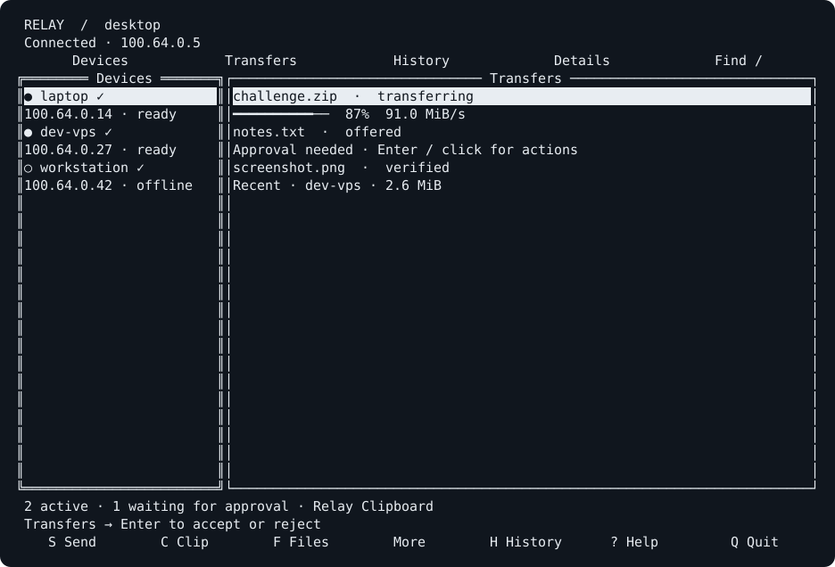

# Relay

**Files, clipboard, and development context — across your Tailnet, from your terminal.**

Relay is a Linux file-sharing application with the immediacy of LocalSend and a
terminal-first workflow. Pick a device, pick some files, send. Its independent
daemon keeps working while you close the interface, switch terminals, or use the
CLI from another session.

No Relay account, hosted service, or SSH credentials. Your existing Tailscale
connection supplies the network; Relay supplies device identity, trust,
transfer recovery, and the interface.



*Actual widgets captured with tcell SimulationScreen; device names and transfers
are fictional fixture data. [Capture details](docs/screenshots/README.md).*

## What works today

- Automatic Tailnet discovery, with separate indicators for Tailscale online and
  Relay ready. Device names work in both the TUI and CLI.
- A responsive keyboard and mouse interface, searchable device and transfer
  lists, incoming approvals, history, and an integrated multi-directory picker.
- Queue sends to sleeping, previously trusted devices; Relay delivers when they
  reconnect. Recent verified completions stay visible beside active work.
- Files, directories, empty files, executable bits, modification times, and
  Unicode names. Payloads stream through bounded buffers.
- SHA-256 verification before each file is published. Interrupted transfers keep
  their partial data, verify the existing prefix, and resume after reconnection
  or daemon restart. Identical retries recover completed receipts.
- Explicit fingerprint pairing, TLS 1.3 application encryption, collision
  policies, pause, cancel, and trust revocation.
- Wayland/X11 clipboard integration when available, plus a private Relay
  Clipboard for SSH and headless machines. Text and URLs never launch programs.

V1 has a deliberately small transport: one TLS connection per transfer,
sequential files within each transfer, and bounded concurrency across transfers.
See [current limits](#current-limits-and-roadmap) and the
[validation report](docs/VALIDATION.md) before treating this new implementation
as an audited production system.

## Install

### Android companion

Relay now includes a native Android app for sending files, text and URLs to your
other devices and receiving verified transfers. It uses the same encrypted
protocol as the terminal app. Install the APK from the
[releases page](https://github.com/PLASMA-FR/relay/releases), connect Tailscale,
and enable availability in Relay. On your computer:

```sh
relay mobile invite --qr
```

Scan the QR code from **Add device** on the phone and confirm the fingerprint.
Copy the phone's pairing link from **My device**, then verify the reverse direction:

```sh
relay mobile pair 'relay://pair?...'
```

Android offers saved-device discovery, a share-sheet target, transfer controls,
incoming notifications, and a private inbox with explicit save/share actions.
See the [mobile guide](mobile/README.md) for installation, build instructions and
Android-specific limitations. Existing protocol-v1 desktop peers remain compatible.

### Linux terminal app

Prebuilt Linux amd64 and arm64 archives are available on the
[releases page](https://github.com/PLASMA-FR/relay/releases). Download the matching
archive and `checksums.txt`, verify the archive with SHA-256, extract it, and run
its `./install.sh`. Installing a prebuilt archive does not require Go.

Requires Linux and an authenticated local Tailscale installation. Building from
source also requires Git and **Go 1.25 or newer**. Relay uses `tailscale status
--json`; it does not need a Tailscale API key or a second device login.

```sh
git clone https://github.com/PLASMA-FR/relay.git
cd relay
./install.sh
relay --help
```

The installer builds a single binary into `~/.local/bin/relay`, installs shell
completions, preserves existing configuration, and reports missing prerequisites.
Add `~/.local/bin` to your shell's `PATH` if the installer tells you it is missing.
It does not install or authenticate Tailscale for you.

```sh
./install.sh --user                         # explicit user installation
./install.sh --service                      # also install/start a user service
./install.sh --prefix "$HOME/.local"        # choose an installation prefix
./install.sh --binary ./relay-linux-arm64   # use an existing binary
```

Managed installations update in place. An unmanaged or externally modified
binary is preserved unless `--force` is supplied; the replacement keeps a backup.
Release build targets reproduce the Linux amd64 and arm64 archives locally.

## First transfer

On **both devices**, confirm `tailscale status` works, then start Relay:

```sh
relay
```

The client starts a background daemon when needed. `relay devices` lists
discoverable devices; the remote machine must also be running Relay. Tailnet
policy must allow TCP **7331** between the devices. Do not expose this port
through a public forwarding rule or Tailscale Funnel.

Pair once in each direction. From desktop:

```sh
relay pair laptop
# Compare the full fingerprint with `relay status` on laptop.
relay trust laptop --fingerprint <verified-laptop-fingerprint>
```

From laptop:

```sh
relay pair desktop
# Compare the full fingerprint with `relay status` on desktop.
relay trust desktop --fingerprint <verified-desktop-fingerprint>
```

Replace the placeholders with the complete 64-character SHA-256 fingerprints.
`pair` observes identity; it does **not** grant trust. Trusting a hostname merely
because it looks familiar is insufficient. The TUI provides the same comparison
and confirmation in device details.

Now send:

```sh
relay send laptop ~/Downloads/challenge.zip
relay send laptop file1.txt file2.txt ./project
```

Trusted transfers are accepted automatically by default. Set
`receive.auto_accept_trusted = false` for individual Accept / Reject prompts.
On a headless receiver, use `relay transfers` followed by `relay accept ID` or
`relay reject ID`. `relay doctor` explains local setup problems.

## In the terminal

Select a device, press **S**, select paths with **Space**, then press **S** again.
A single highlighted path can be sent directly. Selection survives changing
directories, and overlapping parent/child selections are deduplicated.

| Key | Action |
| --- | --- |
| Arrows; `j` / `k` | Navigate |
| Left / Right; `h` / `l`; Tab | Change focus |
| Enter / `D` | Device or transfer details |
| `S` / `F` | File picker |
| `C` | Send clipboard |
| Space, on a device | All send actions, including text and URL |
| `/` | Search the current list |
| `H` | History / active transfers |
| `R` | Refresh devices or resume a selected transfer |
| `P` / `X` | Pause / cancel a transfer |
| `A` | Accept an incoming offer |
| Esc; `?`; `Q` | Back; help; quit client |

Lowercase `h` belongs to Vim navigation; uppercase `H` opens history. Clickable
tabs, dialogs, checkboxes, and transfer actions expose the same workflows.
Mouse-wheel scrolling works where the terminal forwards mouse events. Use your
terminal's text-selection modifier, often Shift, to select terminal text.

The picker supports **Ctrl-L** for a path, **Backspace** for its parent, **.** for
hidden files, and **O** for sorting. At 80×24 the main panes share the screen;
narrower terminals show the focused pane, and wide terminals add details.
`NO_COLOR` and ASCII decorations are supported. See the
[complete interaction guide](docs/TUI.md) for SSH, tmux, and picker controls.

## CLI and pipelines

```sh
relay devices --json
relay status
relay transfers
relay history

git diff | relay text dev-vps
relay text laptop "Build finished"
relay clip laptop
relay open laptop https://example.com

tar czf - project | relay send laptop --stdin project.tar.gz
relay send laptop ./build --detach --json

relay clipboard copy "keep this on the VPS"
relay clipboard show
relay clipboard paste | another-command

relay pause ID
relay resume ID
relay cancel ID
relay trust
relay untrust laptop
```

Sending waits for completion by default. Progress goes to stderr; the result
goes to stdout. `--detach` returns after queueing, and `--json` emits structured
results. **Ctrl-C stops waiting; it does not cancel the daemon's transfer.** Use
`relay cancel ID` to cancel it. Interrupted send jobs retry with backoff; paused
jobs require resume. If you pause on the receiver, resume there before retrying
from the sender.

Streamed stdin is first spooled privately to disk, so it remains resumable after
the pipe exits. Budget disk space for that spool as well as the receiving copy.
Text and clipboard content are limited to 1 MiB; use `--stdin NAME` for larger or
binary streams. In SSH sessions the clipboard is explicitly the Relay Clipboard.
Incoming text updates that clipboard, without replacing the desktop clipboard.

Exit codes: `0` success, `1` operational failure, `2` usage/configuration failure,
`3` unsuccessful or paused transfer, and `130` interrupted CLI operation.
`--no-start` prevents daemon auto-start, useful in scripts and diagnostics.
`relay --help` and command-specific `--help` describe all flags.

## Configuration and storage

Configuration is optional: `~/.config/relay/config.toml`, honoring
`XDG_CONFIG_HOME`. Start with [config.example.toml](config.example.toml):

```toml
name = "desktop"

[receive]
directory = "~/Downloads/Relay"
auto_accept_trusted = true
conflict = "rename"
max_bytes = 1099511627776 # 1 TiB per offer, not a disk quota

[ui]
mouse = true
vim_keys = true
ascii = false

[clipboard]
fallback_internal = true

[network]
tailscale_only = true
port = 7331
max_concurrent = 3
discovery_seconds = 15
```

The default inbox is `~/Downloads/Relay` when `~/Downloads` exists, otherwise
`~/relay-inbox`. Collision policies are `rename`, `skip`, `cancel`, and explicit
`replace`; replacement supports regular files only. Restart the daemon after
editing configuration (`relay service restart`, or `relay stop` followed by
`relay` for an automatically started daemon). Keep the same Relay port across
your devices.

| Data | Default location |
| --- | --- |
| Identity, trust, queue, history, Relay Clipboard | `~/.local/state/relay/` |
| Cache | `~/.cache/relay/` |
| Local IPC | `$XDG_RUNTIME_DIR/relay.sock` |
| IPC when no runtime directory exists | `~/.local/state/relay/run/relay.sock` |
| Incomplete incoming payloads | `.relay-part-*` inside the inbox |

State/cache honor the corresponding XDG variables. `--config` or `RELAY_CONFIG`
selects configuration; `RELAY_STATE_DIR` and `RELAY_SOCKET` can isolate separate
development instances. A different config file alone does not isolate identity
or state. State directories are private, identity files use mode `0600`, and
the Unix socket requires a private directory owned by the current user.

## VPS and systemd

No X server, Wayland session, notification service, or desktop clipboard is
required. Install the user service for dependable operation across sessions;
installation gracefully hands off an existing automatically started daemon:

```sh
relay service install
relay service status
relay service restart
relay service stop
relay service start
```

For a VPS, set `receive.directory = "~/relay-inbox"`. Ask your administrator to
enable user lingering with `loginctl enable-linger USER` if the service must
survive the last logout and start at boot. A detached daemon alone remains
subject to the host's session-cleanup policy. Without user systemd, run
`relay daemon` under your existing process supervisor.

Uninstall the binary/completions with `./uninstall.sh`; use
`./uninstall.sh --service` to remove the service too. `relay service uninstall`
removes only the service. Uninstallation preserves received files, configuration,
identity, trust, and history. Delete those locations manually only when you
intend to discard them; removing identity requires pairing again.

## Troubleshooting

Run `relay doctor` first. It checks IPC, configuration, Tailscale, peer discovery,
the inbox, private state, clipboard, terminal, and the user service.

| Symptom | Next step |
| --- | --- |
| Tailscale unavailable | Run `tailscale status`; install/authenticate it or start `tailscaled`. |
| Device online, Relay unavailable | Start Relay on that device; check Tailnet policy and the shared TCP port. |
| Peer identity changed | Compare the new full fingerprint independently; Relay does not trust it automatically. |
| Transfer interrupted | Restore connectivity and leave the source unchanged; inspect `relay transfers`. |
| Resume prefix differs | Preserve the source/partial for inspection and start a new transfer; Relay refuses the mismatch. |
| Inbox or collision error | Check free disk space, permissions, and `receive.conflict`; retries preserve partial data. |
| IPC permission error | Put the socket in a directory owned by your user with mode `0700`. |
| Service unavailable over SSH | Check `systemctl --user status relay`; configure lingering or use a supervisor. |
| Mouse unavailable | Check terminal/tmux mouse forwarding, or set `ui.mouse = false`; keyboard controls remain available. |

An automatically started daemon logs to its state directory's `daemon.log`.
For systemd, use `journalctl --user -u relay.service`. Cancelled or abandoned
incoming partials and protocol journals are retained for explicit local cleanup;
do not remove them while a related transfer is active.

## Architecture and security

```text
CLI / tview TUI ── private Unix HTTP IPC ── Relay daemon
                                                 │
                                pinned mutual TLS 1.3
                                      over Tailscale
                                                 │
                                           peer daemon
```

The daemon owns discovery, networking, durable jobs, and trust. The TUI consumes
coalesced event snapshots and tcell renders terminal cell differences. File
payloads use versioned binary frames, bounded streaming, and SHA-256 verification.

There is no Relay cloud. Tailscale may carry connections through its encrypted
DERP transport when a direct route is unavailable. Tailnet access does not grant
Relay trust. V1 trust permits the supported file/text/URL operations; it never
permits remote commands. Read the [security model](SECURITY.md) and
[protocol specification](docs/PROTOCOL.md) for exact boundaries.

## Development

```sh
make build
make test
make race
make vet
make fmt
make bench
make large-test  # opt-in 1 GiB and 3 GiB transfers; needs several GiB free
make release    # Linux amd64/arm64 builds
```

The direct checks remain `go test ./...` and `go vet ./...`. Tests include real
loopback TLS transfers, restart/resume, filesystem confinement, checksums,
clipboard/CLI workflows, and simulated keyboard, mouse, and resize events.
See [measurements](docs/PERFORMANCE.md) and
[environment-specific validation](docs/VALIDATION.md). Local loopback results
are not live Tailnet throughput claims.

## Current limits and roadmap

V1 rejects symlinks and special files. It does not copy ownership, ACLs, xattrs,
or sparse layout. Each file is finalized atomically; a directory transfer is
not an atomic filesystem snapshot. Send stable source trees.

Compression, content-based deduplication across unrelated sends, per-device
permissions, per-device inboxes, desktop notifications, and automatic retention
cleanup are not implemented. Resume validates the complete saved prefix, which
uses disk time even when little remains to transmit.

The next useful improvements are retention controls, more live Tailnet and
desktop validation, measured transport tuning, and finer trust policies. Changes
to protocol or performance must preserve safe paths, bounded resources, and
verified recovery.

[License](LICENSE)
