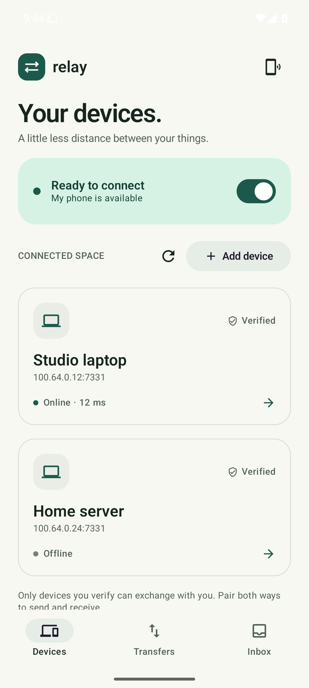
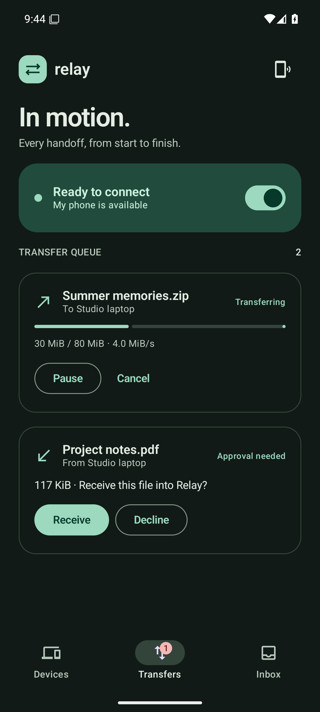

# Relay for Android

Relay for Android sends files, text, and links between your phone and your other
Relay devices over Tailscale. It uses the same authenticated, resumable v1 transfer
engine as the desktop application, with a native Android interface and a private
inbox. There is no separate Relay account or Relay cloud service.

<p>
  
  
</p>

These are actual emulator captures with fictional test devices and transfers.
The [release startup capture](../docs/screenshots/android/release-app-startup.png)
shows the real app's empty first-run state. See [validation](../docs/MOBILE-VALIDATION.md).

Android **0.3.0** (version code **2**) is included with **Relay 0.3.0**.
Devices on your Tailnet connect automatically by default, without Relay pairing.
Update Relay on both ends for this behavior. Older 0.2.0 peers retain their own
manual trust policy; the new app cannot override it remotely. The v1 transfer
protocol remains compatible when the older peer's trust requirements are met.
See the [desktop guide](../README.md) for installation and desktop commands.

## What you need

- Android 8.0 / API 26 or newer. The default APK includes ARM64 phone and x86_64
  emulator/device libraries; it does not include 32-bit ARM libraries.
- The Tailscale Android app, connected to the same tailnet as the other device.
  If you use Tailscale's app exclusions, ensure **Relay is included in the VPN**.
  Relay does not bundle or start its own VPN.
- Relay running on the other device, with tailnet policy allowing the connection.
  The phone listens on TCP port 7331 at its Tailscale address.

Install the Android APK from the relevant
[Relay release](https://github.com/PLASMA-FR/relay/releases), when available, or
build a debug APK using the instructions below. Android may ask you to allow APK
installation from the browser or file manager used to open it.

## Connect a phone and computer

1. Connect Tailscale on both devices and start Relay 0.3.0 on the computer.
2. In the Android app, turn **Device availability** on. Relay becomes ready when
   this app's active VPN provides a Tailscale address.
3. Wait for discovery. The desktop discovers the phone and exchanges device
   addresses with it; the phone then discovers reachable Relay devices from those
   addresses. Open a device to send. No QR code, invitation, or fingerprint
   confirmation is required in the default **Tailnet** trust mode.

Devices must be running Relay, reachable through your Tailnet policy, and not
blocked. Discovery shares device names and numeric Relay endpoints; each
connection checks the actual TLS identity before automatic authorization.

**Add device** remains an optional discovery fallback. Enter a numeric Tailscale
address, optionally with a Relay port. DNS names and ordinary LAN addresses are
not accepted. If only phones are running and none has a saved device or a desktop
to introduce peers, add one phone's address on another to start discovery. This
supplies an address; it does not require pairing in Tailnet mode. Android cannot
enumerate the Tailnet itself, and Relay does not scan IP ranges.

Saved devices and addresses learned through authenticated peer directories are
checked automatically and by **Refresh**. A blocked device stays blocked across
refreshes and restarts. Use **Unblock** in its details to allow automatic discovery
again. Blocking also stops that device's active transfers.

The advanced manual trust setting retains fingerprint comparison and explicit
**Trust device** confirmation. In that mode, adding an address or importing an
invitation produces a candidate for review. A previously blocked device still
requires confirmation before manual trust clears its block. Optional invitation
links and QR codes carry only public identity information; importing one checks
its fingerprint against a live TLS probe and applies the selected trust mode.

## Send, receive, and keep files

Select a trusted, reachable device to send files, text, a web link, or clipboard
text. **Send clipboard** reads the Android clipboard only when you select it and
lets you review the text before sending. You can also choose Relay from another
Android app's share sheet, then select the destination device and send.

The file picker imports private staged copies before queueing a transfer. Each
handoff accepts **1–32 file paths** with an aggregate limit of **2 GiB**. Incoming
transfers also have a 2 GiB receive limit. Text and links are limited to **1 MiB**;
links must use HTTP or HTTPS and are never opened automatically. Allow enough
free app storage for staged outgoing copies and incoming files.

Automatic device trust and receive approval are separate. Incoming offers from
trusted devices require **Accept** or **Reject** by default.
Use the Transfers tab, or the incoming-transfer notification while availability
is enabled. Android 13 and newer ask for notification permission; if you decline,
open Relay to review offers. **Automatically accept** in device settings applies
only to trusted senders and is off by default.

Received text appears as the **latest Relay Clipboard** in the Inbox. It never
replaces the Android system clipboard automatically. Use the explicit copy action
when you want it there. Relay keeps the latest received text privately, rather
than retaining a text-content archive in transfer history.

Completed files appear in the private Inbox with verification status. Use **Save to device**
to export a file through Android's document picker, or **Share** to grant another
app temporary read access. Files are not published automatically to Downloads or
a shared storage folder. Filename collisions are handled by renaming incoming
files instead of overwriting existing ones.

The Transfers tab exposes pause, resume/retry, and cancel where applicable.
Incomplete jobs, their original manifests, saved device information, manual trust
pins, and blocks survive process restarts. Automatic trust is re-established by
live discovery after the VPN reconnects. Reconnect Tailscale and turn availability
back on to continue; manually paused transfers need **Resume**. Failed jobs keep their sources for inspection
or retry. Cancelled or rejected jobs cannot be resumed as the same job.

After a successful completion, cancellation, or rejection, the core removes
outgoing staged copies once the worker has released them and the final state is
durable. It retains copies referenced by another active or resumable job, including
failed jobs, and never deletes an Inbox original merely because it was forwarded.

Incoming partial files and protocol journals are currently retained for resume
and need explicit local cleanup when abandoned. There is no per-transfer storage
purge screen yet. They are in private app storage, so ordinary file managers cannot
clean them directly. Developer inspection or app-data cleanup must happen with
related transfers stopped. Clearing app data or uninstalling is a complete reset,
not a selective cleanup: export wanted Inbox files first. A reset creates a new
identity that must be discovered again; manual mode requires new verification.

## Availability and identity

Availability is an explicitly started foreground session, with a persistent
notification and a **Stop** action. Turning it off stops network activity while
keeping resumable state. Losing the VPN pauses connectivity; an existing session
can reconnect when the VPN returns.

Android or the device manufacturer's power management can still stop the process
or foreground service. Relay does not restart at boot or silently restart after
process death. Open the app and enable availability again when needed; do not
assume a phone is permanently reachable just because you enabled it earlier.

Each installation has a private identity stored outside Android backup. The app
also disables backup of its data. Normal app restarts and updates preserve this
identity and private Inbox. Updating from 0.2.0 enables Tailnet trust by default
when the saved state has no trust-mode preference, while retaining the identity,
Inbox, queue, and existing manual pins. An explicitly selected manual mode stays
manual on subsequent restarts.

Uninstalling, clearing app data, or losing the installation's private storage
creates a new identity. Tailnet mode can discover its new key automatically;
manual mode requires a fresh fingerprint comparison. Existing queued transfers
remain bound to their original device key and are never silently redirected to
the replacement identity. Create a new transfer for the replacement device.

Debug and release installs have separate identities, trust, queues, and inboxes.

Automatic trust assumes your active VPN is Tailscale. Relay checks this app's
active network for VPN transport and a Tailscale-range link address; an unrelated
VPN or a Tailscale VPN that excludes Relay does not qualify merely because it is
installed. Public Android APIs cannot prove which provider owns the active VPN,
so this check is not Tailscale identity attestation. Connect Tailscale as Relay's
active VPN. Incoming automatic authorization also requires the actual numeric
source address and a reverse Relay TLS probe with the exact same key. VPN loss
or replacement clears automatic authorization and cancels discovery.

For the shared wire protocol and trust boundaries, read the
[security model](../SECURITY.md) and [protocol specification](../docs/PROTOCOL.md).

## Build an APK

Use a host supported by the upstream GoMobile/Android NDK toolchain: **Linux
x86_64 or macOS**. The build script does not configure Windows or Linux ARM64
cross-compilation workarounds.

Install:

- Go **1.26 or newer** for the isolated `mobile/bind` tool module; CI uses Go 1.27.
  The desktop module still has its own Go 1.25 minimum.
- JDK **17**, with `JAVA_HOME` set appropriately.
- Android SDK command-line tools, platform **35**, build-tools **35.0.0**, and NDK
  **27.2.12479018**, with `ANDROID_HOME` pointing to the SDK directory.

For example, after installing the SDK command-line tools and accepting their
licenses:

```sh
sdkmanager 'platforms;android-35' 'build-tools;35.0.0' 'ndk;27.2.12479018'
./mobile/build-android.sh debug
```

Run the build command from the repository root. It builds the GoMobile tools and
shared core AAR, then runs Gradle's debug unit tests and lint before assembling the
APK. The Gradle wrapper pins Gradle 8.11.1; the project uses AGP 8.9.2 and Kotlin
2.1.20. Dependencies and the Android SDK must be available to the build host.

Outputs:

| Build | Output |
| --- | --- |
| Shared native core | `mobile/android/app/libs/relaycore.aar` |
| Debug APK | `mobile/android/app/build/outputs/apk/debug/app-debug.apk` |
| Signed release APK | `mobile/android/app/build/outputs/apk/release/app-release.apk` |

Install the debug APK on a connected device or running emulator:

```sh
adb install -r mobile/android/app/build/outputs/apk/debug/app-debug.apk
```

Debug uses application ID `io.github.plasmafr.relay.debug` and can be installed
alongside release `io.github.plasmafr.relay`. A debug build does not replace or
reuse a release installation's identity or data.

To work in Android Studio, first run `./mobile/build-core.sh` from the repository
root, then open `mobile/android`. The Android project consumes the generated AAR;
opening it directly does not compile the Go core for you. Rebuild the AAR after
changes to Go code. The default native targets are `android/arm64,android/amd64`;
`RELAY_ANDROID_TARGETS` can override them for a supported toolchain. An alternate
installed NDK can be selected with `ANDROID_NDK_HOME`.

### Signed release builds

Use a private release keystore outside the repository. Supply these environment
variables through your local secret manager or CI secret configuration:

| Variable | Purpose |
| --- | --- |
| `RELAY_ANDROID_KEYSTORE` | Absolute path to the release keystore |
| `RELAY_ANDROID_STORE_PASSWORD` | Keystore password |
| `RELAY_ANDROID_KEY_ALIAS` | Signing alias; defaults to `relay` |
| `RELAY_ANDROID_KEY_PASSWORD` | Private-key password |

Then run:

```sh
./mobile/build-android.sh release
```

The release helper requires a configured keystore. Never commit signing files or
passwords. Keep the release signing key safe: Android updates need the same signing
identity. This release uses app version `0.3.0` and Android version code `2`.

## Verification

Run the ordinary Go integration and race tests from the repository root:

```sh
go test -race ./mobile/relaycore ./internal/invite
```

The core tests run against the real v1 transfer engine using package-private
loopback injection. They cover file/text interoperability, fingerprint pinning,
manual approvals, revocation, restart recovery, actual partial-file resume,
source confinement, lifecycle races, and shared-source staging cleanup. Automatic
mode coverage includes desktop-to-fresh-phone directory bootstrap, a third
discovered peer, bounded hints, source/key verification, VPN-loss cancellation,
durable blocks, migration, manual-mode separation, and old queued-key binding.
Cross-mode tests check that manual unblock and its pin commit together, including
storage-failure rollback. Production mobile APIs expose no loopback or
insecure-network switch.

After building the AAR, run Android checks from `mobile/android`:

```sh
./gradlew --no-daemon testDebugUnitTest lintDebug assembleDebug assembleDebugAndroidTest
./gradlew --no-daemon connectedDebugAndroidTest
```

The second command needs an attached Android device or emulator. The
[Android workflow](https://github.com/PLASMA-FR/relay/actions/workflows/android.yml) configures an API 35 x86_64
emulator, runs instrumentation, and collects APKs, reports, and available emulator
screenshots. Instrumentation checks native initialization and interface behavior;
it does not replace a physical-phone Tailscale transfer test. Consult the actual
workflow reports for test results; the existence of a workflow is not a claim
that instrumentation has passed.
